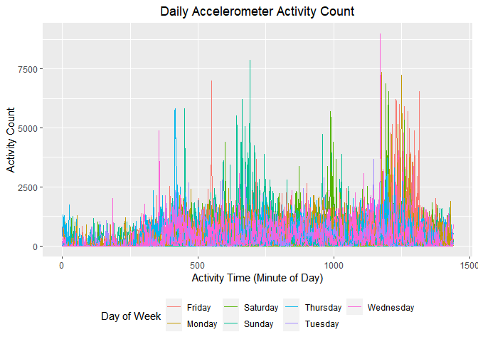
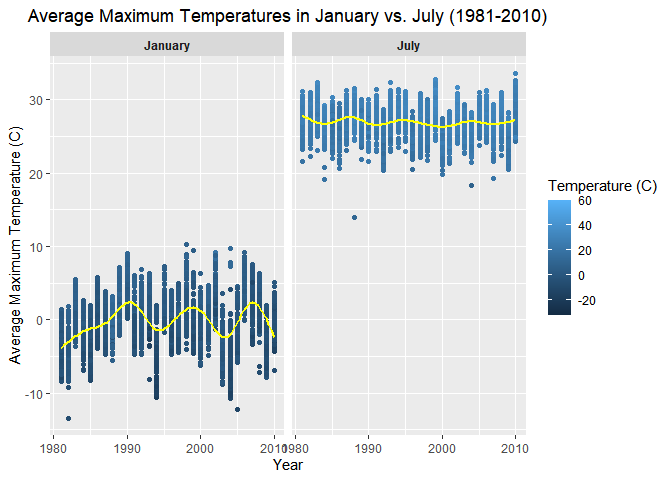
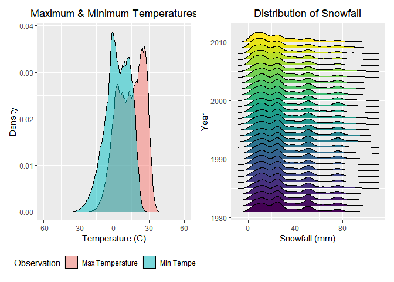

P8105 Data Science I Homework 3
================
Olivia Wang (hw2852)
2022-10-15

In preparation for the problems below, we will load the following
libraries:

``` r
library(tidyverse)
```

    ## ── Attaching packages ─────────────────────────────────────── tidyverse 1.3.2 ──
    ## ✔ ggplot2 3.3.6      ✔ purrr   0.3.4 
    ## ✔ tibble  3.1.8      ✔ dplyr   1.0.10
    ## ✔ tidyr   1.2.0      ✔ stringr 1.4.1 
    ## ✔ readr   2.1.2      ✔ forcats 0.5.2 
    ## ── Conflicts ────────────────────────────────────────── tidyverse_conflicts() ──
    ## ✖ dplyr::filter() masks stats::filter()
    ## ✖ dplyr::lag()    masks stats::lag()

``` r
library(readxl)
library(dplyr)
library(patchwork)
```

# Problem 1

This problem uses the `Instacart` data. This data set will be loaded
through the `p8105.datasets` library.

``` r
library(p8105.datasets)
data("instacart")
```

## 1.1 Description of `Instacart` Data

The `instacart` data set contains **1384617 rows** and **15 columns**.
Each row in the data set corresponds to a single item of an Instacart
order. The variables in the data set include ID numbers corresponding to
orders, products, and Instacart users, as well as the order in which a
particular product was added to cart. The data set contains a number of
order-level variables that describe the date and time an order was made,
and the number of days since a previous order was made. There are also
several item-specific variables that describe the product name,
department to which the product belongs, the aisle in which the product
can be found, and relevant order history.

There are **39123 products** found in **131209 orders** from **131209
distinct users**.

## 1.2 Analysis of `Instacart` Data

### Enumerating Total Aisles

We can enumerate the number of aisles by applying the `group_by`
function to identify the number of unique `aisle_id` variable values.
The number of rows generated in the output would be the number of aisles
in the data set. Building upon the results generated from the `group_by`
function, we may determine the aisles from which the most items were
ordered. This process involves generating a summary of the number of
times each `aisle_id` appears in these data, then arranging the aisles
in decreasing order of the number of times it appears.

``` r
instacart %>%
  group_by(aisle_id) %>% 
  summarise(items_ordered = n()) %>% 
  arrange(desc(items_ordered))
```

    ## # A tibble: 134 × 2
    ##    aisle_id items_ordered
    ##       <int>         <int>
    ##  1       83        150609
    ##  2       24        150473
    ##  3      123         78493
    ##  4      120         55240
    ##  5       21         41699
    ##  6      115         36617
    ##  7       84         32644
    ##  8      107         31269
    ##  9       91         26240
    ## 10      112         23635
    ## # … with 124 more rows

There are **134 aisles** in the `Instacart` data set. Of the 134 aisles,
the following are the aisles from which the most items are ordered:

| Aisle Number | Number of Items Sold |
|:-------------|----------------------|
| **83**       | 150,609              |
| **24**       | 150,473              |
| **123**      | 78,493               |
| **120**      | 55,240               |
| **21**       | 41,699               |

### Plotting Aisle vs. Items Ordered

Using the `instacart` data set, we can generate a plot showing the
number of items ordered in each aisle, limiting this to aisles with more
than 10,000 items ordered. This process involves counting the number of
distinct aisles and filtering the data to only include aisles in which
more than 10,000 items are ordered. We can then generate a scatter plot
using `ggplot`, with the aisles arranged in increasing order of number
of items ordered.

``` r
instacart %>% 
  count(aisle) %>% 
  filter(n > 10000) %>% 
  mutate(aisle = fct_reorder(aisle, n)) %>% 
  ggplot(aes(x = aisle, y = n)) + 
  geom_point() + 
  labs(
    title = "Number of Items Ordered per Aisle", 
    x = "Aisle", 
    y = "Number of Items Ordered (n)") +
  theme(axis.text.x = element_text(angle = 60, hjust = 1), 
        plot.title = element_text(hjust = 0.5))
```

<!-- -->

### Top 3 Most Popular Items per Aisle

The following table identifies the top 3 most popular items in the
`baking ingredients`, `dog food care` and `packaged vegetables fruits`
aisles, and enumerates the times each item is ordered.

``` r
instacart %>% 
  filter(aisle %in% c("baking ingredients", "dog food care", "packaged vegetables fruits")) %>%
  group_by(aisle) %>% 
  count(product_name) %>% 
  mutate(rank = min_rank(desc(n))) %>% 
  filter(rank < 4) %>% 
  arrange(desc(n)) %>%
  knitr::kable()
```

| aisle                      | product_name                                  |    n | rank |
|:---------------------------|:----------------------------------------------|-----:|-----:|
| packaged vegetables fruits | Organic Baby Spinach                          | 9784 |    1 |
| packaged vegetables fruits | Organic Raspberries                           | 5546 |    2 |
| packaged vegetables fruits | Organic Blueberries                           | 4966 |    3 |
| baking ingredients         | Light Brown Sugar                             |  499 |    1 |
| baking ingredients         | Pure Baking Soda                              |  387 |    2 |
| baking ingredients         | Cane Sugar                                    |  336 |    3 |
| dog food care              | Snack Sticks Chicken & Rice Recipe Dog Treats |   30 |    1 |
| dog food care              | Organix Chicken & Brown Rice Recipe           |   28 |    2 |
| dog food care              | Small Dog Biscuits                            |   26 |    3 |

### Mean Hour of Purchases: Pink Lady Apples & Coffe Ice Cream

This final table displays the mean hour of the day at which the Pink
Lady Applies and Coffee Ice Cream products are ordered each day of the
week.

``` r
instacart %>%
  filter(product_name %in% c("Pink Lady Apples", "Coffee Ice Cream")) %>%
  group_by(product_name, order_dow) %>%
  summarize(mean_hour = mean(order_hour_of_day)) %>%
  spread(key = order_dow, value = mean_hour) %>%
  knitr::kable(digits = 2)
```

    ## `summarise()` has grouped output by 'product_name'. You can override using the
    ## `.groups` argument.

| product_name     |     0 |     1 |     2 |     3 |     4 |     5 |     6 |
|:-----------------|------:|------:|------:|------:|------:|------:|------:|
| Coffee Ice Cream | 13.77 | 14.32 | 15.38 | 15.32 | 15.22 | 12.26 | 13.83 |
| Pink Lady Apples | 13.44 | 11.36 | 11.70 | 14.25 | 11.55 | 12.78 | 11.94 |

Based on the table generated above, we can conclude that Pink Lady
Apples are usually purchased earlier in the day than Coffee Ice Cream,
with the exception of Day 5.

# Problem 2

## 2.1 Accelerometer Data: Read, Tidy, Wrangle

We will begin by importing and cleaning the CSV file containing this
patient’s accelerometer data. This process involves data import,
cleaning variable names, and applying the `pivot_longer` function to
convert the data from wide to long format. A new `weekend_vs_weekday`
variable was generated to indicate whether the entry corresponds to a
weekend or a weekday.

``` r
accelerometer_data = 
  read_csv("./accel_data.csv") %>% 
  janitor::clean_names(.) %>% 
  mutate(weekend_vs_weekday = if_else(day != "Saturday" & day != "Sunday","weekday", "weekend")) %>% 
  pivot_longer(
    activity_1:activity_1440, 
    names_to = "activity_time", 
    names_prefix = "activity_",
    names_transform = list(activity_time = as.integer),
    values_to = "activity_count")
```

    ## Rows: 35 Columns: 1443
    ## ── Column specification ────────────────────────────────────────────────────────
    ## Delimiter: ","
    ## chr    (1): day
    ## dbl (1442): week, day_id, activity.1, activity.2, activity.3, activity.4, ac...
    ## 
    ## ℹ Use `spec()` to retrieve the full column specification for this data.
    ## ℹ Specify the column types or set `show_col_types = FALSE` to quiet this message.

The tidied `accelerometer_data` data set contains **50400 rows** and **6
columns**. Each row in the data set corresponds to a single reading of
accelerometer activity. The variables in the data set include
identifiers of the week, day, and minute of the day at which the
accelerometer activity count is recorded. The newly created
`weekend_vs_weekday` variable also identifies whether the reading
corresponds to a weekend or a weekday. Accelerometer activity count data
is collected on **35 days** over **5 weeks**.

## 2.2 Total Daily Activity

Using the tidied accelerometer data generated in Part 2.1, we can
aggregate across daily minutes to create a total activity variable for
each of the 35 days of observation. We will first group the entries by
`day_id`, then apply the `summarise` function to generate a new variable
taking on the value of the sum of the activity counts associated with
the specific `day_id`.

``` r
accelerometer_data %>% 
  group_by(day_id) %>% 
  mutate(total_daily_activity = sum(activity_count)) %>% 
  summarise(day, total_daily_activity) %>% 
  distinct %>% 
  print(n = 35) %>% 
  knitr::kable()
```

    ## `summarise()` has grouped output by 'day_id'. You can override using the
    ## `.groups` argument.

    ## # A tibble: 35 × 3
    ## # Groups:   day_id [35]
    ##    day_id day       total_daily_activity
    ##     <dbl> <chr>                    <dbl>
    ##  1      1 Friday                 480543.
    ##  2      2 Monday                  78828.
    ##  3      3 Saturday               376254 
    ##  4      4 Sunday                 631105 
    ##  5      5 Thursday               355924.
    ##  6      6 Tuesday                307094.
    ##  7      7 Wednesday              340115.
    ##  8      8 Friday                 568839 
    ##  9      9 Monday                 295431 
    ## 10     10 Saturday               607175 
    ## 11     11 Sunday                 422018 
    ## 12     12 Thursday               474048 
    ## 13     13 Tuesday                423245 
    ## 14     14 Wednesday              440962 
    ## 15     15 Friday                 467420 
    ## 16     16 Monday                 685910 
    ## 17     17 Saturday               382928 
    ## 18     18 Sunday                 467052 
    ## 19     19 Thursday               371230 
    ## 20     20 Tuesday                381507 
    ## 21     21 Wednesday              468869 
    ## 22     22 Friday                 154049 
    ## 23     23 Monday                 409450 
    ## 24     24 Saturday                 1440 
    ## 25     25 Sunday                 260617 
    ## 26     26 Thursday               340291 
    ## 27     27 Tuesday                319568 
    ## 28     28 Wednesday              434460 
    ## 29     29 Friday                 620860 
    ## 30     30 Monday                 389080 
    ## 31     31 Saturday                 1440 
    ## 32     32 Sunday                 138421 
    ## 33     33 Thursday               549658 
    ## 34     34 Tuesday                367824 
    ## 35     35 Wednesday              445366

| day_id | day       | total_daily_activity |
|-------:|:----------|---------------------:|
|      1 | Friday    |            480542.62 |
|      2 | Monday    |             78828.07 |
|      3 | Saturday  |            376254.00 |
|      4 | Sunday    |            631105.00 |
|      5 | Thursday  |            355923.64 |
|      6 | Tuesday   |            307094.24 |
|      7 | Wednesday |            340115.01 |
|      8 | Friday    |            568839.00 |
|      9 | Monday    |            295431.00 |
|     10 | Saturday  |            607175.00 |
|     11 | Sunday    |            422018.00 |
|     12 | Thursday  |            474048.00 |
|     13 | Tuesday   |            423245.00 |
|     14 | Wednesday |            440962.00 |
|     15 | Friday    |            467420.00 |
|     16 | Monday    |            685910.00 |
|     17 | Saturday  |            382928.00 |
|     18 | Sunday    |            467052.00 |
|     19 | Thursday  |            371230.00 |
|     20 | Tuesday   |            381507.00 |
|     21 | Wednesday |            468869.00 |
|     22 | Friday    |            154049.00 |
|     23 | Monday    |            409450.00 |
|     24 | Saturday  |              1440.00 |
|     25 | Sunday    |            260617.00 |
|     26 | Thursday  |            340291.00 |
|     27 | Tuesday   |            319568.00 |
|     28 | Wednesday |            434460.00 |
|     29 | Friday    |            620860.00 |
|     30 | Monday    |            389080.00 |
|     31 | Saturday  |              1440.00 |
|     32 | Sunday    |            138421.00 |
|     33 | Thursday  |            549658.00 |
|     34 | Tuesday   |            367824.00 |
|     35 | Wednesday |            445366.00 |

It is difficult to identify any apparent trend through the tabulated
data alone. Based on a cursory glance, we can see that on days 24 and
31, both of which are Saturdays, the accelerometer activity count at
every minute of the day were 1, thus aggregating to a total of 1440 over
24 hours for both those days. To more effectively identify trends in
these data, it would be helpful to generate a scatter or line plot to
view how the accelerometer activity count data varies over time.

## 2.3 Plotting Accelerometer Daily Activity Count

We can apply the `ggplot` function to generate a single-panel plot
depicting the 24-hour activity time courses for each of the 35 days of
observation. In the line graph below, each day of observation’s
accelerometer activity count data is plotted against the corresponding
minute of the day at which the reading was recorded, with the different
colors delineating the day of the week.

``` r
accelerometer_data %>% 
  ggplot(aes(x = activity_time, y = activity_count, color = day)) +
  geom_line(aes(group = day_id)) +
  theme(
    legend.position = "bottom", 
    plot.title = element_text(hjust = 0.5)) +
  labs(
    title = "Daily Accelerometer Activity Count", 
    x = "Activity Time (Minute of Day)", 
    y = "Activity Count",
    color = "Day of Week") 
```

<!-- -->

Based on the line plot generated above, we can see that activity counts
are lower during hours of the day at which the patient under observation
is likely asleep. More specifically, between the hours of around 9:30pm
(minute 1300) to 4:00am (minute 250), accelerometer activity count are
consistently lower than during other times of the day, and there are
also fewer outlying jumps in activity count during those times.
Furthermore, these data also show increased average accelerometer
activity counts during the hours of around 7:00pm (minute 1170) to
10:30pm (minute 1350). There does not seem to be a specific day of the
week during which sudden increases in activity count is more frequent.
The main trends observable in these data are mainly with respect to the
time of day during which increases or decreases of activity count are
apparent.

# Problem 3

This problem uses `NY NOAA` data. This data set will be loaded through
the `p8105.datasets` library.

``` r
library(p8105.datasets)
data("ny_noaa")
skimr::skim(ny_noaa)
```

|                                                  |         |
|:-------------------------------------------------|:--------|
| Name                                             | ny_noaa |
| Number of rows                                   | 2595176 |
| Number of columns                                | 7       |
| \_\_\_\_\_\_\_\_\_\_\_\_\_\_\_\_\_\_\_\_\_\_\_   |         |
| Column type frequency:                           |         |
| character                                        | 3       |
| Date                                             | 1       |
| numeric                                          | 3       |
| \_\_\_\_\_\_\_\_\_\_\_\_\_\_\_\_\_\_\_\_\_\_\_\_ |         |
| Group variables                                  | None    |

Data summary

**Variable type: character**

| skim_variable | n_missing | complete_rate | min | max | empty | n_unique | whitespace |
|:--------------|----------:|--------------:|----:|----:|------:|---------:|-----------:|
| id            |         0 |          1.00 |  11 |  11 |     0 |      747 |          0 |
| tmax          |   1134358 |          0.56 |   1 |   4 |     0 |      532 |          0 |
| tmin          |   1134420 |          0.56 |   1 |   4 |     0 |      548 |          0 |

**Variable type: Date**

| skim_variable | n_missing | complete_rate | min        | max        | median     | n_unique |
|:--------------|----------:|--------------:|:-----------|:-----------|:-----------|---------:|
| date          |         0 |             1 | 1981-01-01 | 2010-12-31 | 1997-01-21 |    10957 |

**Variable type: numeric**

| skim_variable | n_missing | complete_rate |  mean |     sd |  p0 | p25 | p50 | p75 |  p100 | hist  |
|:--------------|----------:|--------------:|------:|-------:|----:|----:|----:|----:|------:|:------|
| prcp          |    145838 |          0.94 | 29.82 |  78.18 |   0 |   0 |   0 |  23 | 22860 | ▇▁▁▁▁ |
| snow          |    381221 |          0.85 |  4.99 |  27.22 | -13 |   0 |   0 |   0 | 10160 | ▇▁▁▁▁ |
| snwd          |    591786 |          0.77 | 37.31 | 113.54 |   0 |   0 |   0 |   0 |  9195 | ▇▁▁▁▁ |

The untidied `ny_noaa` data set contains **2595176 rows** and **7
columns**. Each row in the data set includes the snowfall, snow depth,
maximum and minimum temperature readings corresponding to a specific
weather station on a specific date.

There is no missing data for the `id` and `date` variables. Based on the
data summary generated above, there are over 1 million missing values
for each of maximum and minimum temperature variables. In other words,
temperature measures are missing for approximately half of the entries.
Due to the significant amount of missing temperature data, further
analyses conducted with temperature data may generate invalid
conclusions. There is also missing data for the precipitation, snowfall
and snow depth variables; however, each are missing significantly fewer
entries compared to the number of missing temperature measures, namely
145838 missing values for precipitation, 381221 missing values for
snowfall, and 591786 missing values for snow depth. Missing values of
precipitation, snowfall and snow depth pose significantly lesser issues
for data analysis, since they account for a lower percentage of total
entries.

## 3.1 NY NOAA Data: Tidying Data

We will first tidy the `ny_noaa` data set. This process involves
cleaning variable names, creating new `year`, `month` and `day`
variables from the existing `date` variable, and mutating year, month,
date, precipitation, maximum and minimum temperature variables to
appropriate (i.e., numeric) units).

``` r
ny_noaa_data = ny_noaa %>% 
  janitor::clean_names() %>% 
  separate(col = date, into = c('year', 'month','day'), sep = '-') %>%
  mutate(
    year = as.numeric(year),
    month = as.numeric(month),
    day = as.numeric(day),
    prcp = prcp/10, 
    tmax = as.numeric(tmax) / 10,
    tmin = as.numeric(tmin) / 10
  )
```

## 3.2 Snowfall

Using the tidied `ny_noaa_data` data set, we can determine the most
commonly observed values of snowfall by first grouping the observations
by `snow`, then summarizing the number of observations for each `snow`
value, and arranging the output in descending order.

``` r
ny_noaa_data %>% 
  group_by(snow) %>% 
  summarise(snowfall_n_obs = n()) %>% 
  arrange(desc(snowfall_n_obs)) %>% 
  knitr::kable() 
```

|  snow | snowfall_n\_obs |
|------:|----------------:|
|     0 |         2008508 |
|    NA |          381221 |
|    25 |           31022 |
|    13 |           23095 |
|    51 |           18274 |
|    76 |           10173 |
|     8 |            9962 |
|     5 |            9748 |
|    38 |            9197 |
|     3 |            8790 |
|   102 |            6552 |
|    10 |            5106 |
|    20 |            4797 |
|    64 |            4506 |
|   127 |            3901 |
|    15 |            3672 |
|    18 |            3226 |
|   152 |            3131 |
|    30 |            2814 |
|    89 |            2535 |
|    33 |            2380 |
|    46 |            2123 |
|    28 |            2118 |
|    23 |            1959 |
|   178 |            1650 |
|    36 |            1630 |
|   114 |            1578 |
|   203 |            1475 |
|    41 |            1467 |
|    43 |            1337 |
|    58 |            1198 |
|    56 |            1179 |
|    53 |            1155 |
|    71 |            1075 |
|   140 |             994 |
|    48 |             918 |
|    61 |             849 |
|    81 |             811 |
|    66 |             790 |
|   254 |             786 |
|   229 |             744 |
|    69 |             726 |
|    97 |             704 |
|    79 |             635 |
|   165 |             614 |
|    84 |             553 |
|   107 |             504 |
|    86 |             476 |
|    74 |             463 |
|   305 |             451 |
|    91 |             428 |
|   191 |             426 |
|   122 |             411 |
|    94 |             404 |
|   109 |             393 |
|   279 |             369 |
|   104 |             349 |
|   132 |             310 |
|   216 |             292 |
|    99 |             276 |
|   117 |             276 |
|   147 |             268 |
|   135 |             253 |
|   119 |             248 |
|   112 |             243 |
|   356 |             235 |
|   330 |             226 |
|   130 |             217 |
|   157 |             209 |
|   241 |             192 |
|   142 |             187 |
|   173 |             187 |
|   155 |             186 |
|   124 |             183 |
|   137 |             173 |
|   145 |             172 |
|   160 |             149 |
|   381 |             139 |
|   163 |             133 |
|   183 |             132 |
|   198 |             130 |
|   267 |             130 |
|   150 |             124 |
|   185 |             117 |
|   406 |             116 |
|   168 |             115 |
|   170 |             104 |
|   457 |             100 |
|   208 |              98 |
|   180 |              93 |
|   292 |              81 |
|   175 |              80 |
|   188 |              77 |
|   196 |              75 |
|   206 |              74 |
|   193 |              70 |
|   318 |              70 |
|   211 |              69 |
|   343 |              63 |
|   432 |              63 |
|   224 |              61 |
|   201 |              60 |
|   213 |              58 |
|   249 |              58 |
|   218 |              55 |
|   508 |              54 |
|   221 |              53 |
|   234 |              52 |
|   236 |              49 |
|   259 |              48 |
|   274 |              45 |
|   483 |              44 |
|   231 |              43 |
|   239 |              39 |
|   246 |              37 |
|   284 |              37 |
|   244 |              36 |
|   226 |              35 |
|   559 |              35 |
|   610 |              35 |
|   257 |              34 |
|   368 |              32 |
|   310 |              29 |
|   262 |              28 |
|   282 |              28 |
|   394 |              27 |
|   264 |              24 |
|   290 |              24 |
|   300 |              24 |
|   272 |              22 |
|   287 |              22 |
|   302 |              22 |
|   312 |              22 |
|   323 |              22 |
|   251 |              21 |
|   277 |              20 |
|   295 |              20 |
|   470 |              20 |
|   584 |              20 |
|   269 |              19 |
|   307 |              17 |
|   338 |              17 |
|   345 |              17 |
|   762 |              17 |
|   533 |              16 |
|   351 |              15 |
|   361 |              15 |
|   366 |              15 |
|   419 |              15 |
|   297 |              14 |
|   363 |              14 |
|   315 |              13 |
|   335 |              13 |
|   340 |              13 |
|   660 |              13 |
|   325 |              12 |
|   353 |              12 |
|   358 |              12 |
|   376 |              12 |
|   414 |              12 |
|   401 |              10 |
|   635 |              10 |
|   711 |              10 |
|   333 |               9 |
|   417 |               9 |
|   737 |               9 |
|   386 |               8 |
|   411 |               8 |
|   427 |               8 |
|   437 |               8 |
|   445 |               8 |
|   521 |               8 |
|   320 |               7 |
|   404 |               7 |
|   434 |               7 |
|   328 |               6 |
|   348 |               6 |
|   373 |               6 |
|   384 |               6 |
|   409 |               6 |
|   467 |               6 |
|   546 |               6 |
|   686 |               6 |
|   378 |               5 |
|   389 |               5 |
|   396 |               5 |
|   422 |               5 |
|   447 |               5 |
|   450 |               5 |
|   452 |               5 |
|   460 |               5 |
|   465 |               5 |
|   475 |               5 |
|   371 |               4 |
|   399 |               4 |
|   455 |               4 |
|   472 |               4 |
|   478 |               4 |
|   488 |               4 |
|   549 |               4 |
|   554 |               4 |
|   597 |               4 |
|   699 |               4 |
|   787 |               4 |
|   914 |               4 |
|   424 |               3 |
|   439 |               3 |
|   462 |               3 |
|   495 |               3 |
|   513 |               3 |
|   518 |               3 |
|   572 |               3 |
|   594 |               3 |
|   632 |               3 |
|   775 |               3 |
|   480 |               2 |
|   490 |               2 |
|   498 |               2 |
|   503 |               2 |
|   505 |               2 |
|   511 |               2 |
|   516 |               2 |
|   523 |               2 |
|   526 |               2 |
|   528 |               2 |
|   551 |               2 |
|   561 |               2 |
|   564 |               2 |
|   592 |               2 |
|   622 |               2 |
|   630 |               2 |
|   643 |               2 |
|   663 |               2 |
|   721 |               2 |
|   813 |               2 |
|   838 |               2 |
|   864 |               2 |
|   -13 |               1 |
|   391 |               1 |
|   429 |               1 |
|   536 |               1 |
|   544 |               1 |
|   556 |               1 |
|   566 |               1 |
|   569 |               1 |
|   574 |               1 |
|   577 |               1 |
|   579 |               1 |
|   587 |               1 |
|   589 |               1 |
|   607 |               1 |
|   612 |               1 |
|   615 |               1 |
|   620 |               1 |
|   625 |               1 |
|   645 |               1 |
|   648 |               1 |
|   650 |               1 |
|   665 |               1 |
|   693 |               1 |
|   704 |               1 |
|   734 |               1 |
|   754 |               1 |
|   808 |               1 |
|   810 |               1 |
|   843 |               1 |
|   861 |               1 |
|   871 |               1 |
|   892 |               1 |
|   940 |               1 |
|   953 |               1 |
|   965 |               1 |
|   978 |               1 |
|  1041 |               1 |
|  1067 |               1 |
|  1105 |               1 |
|  1143 |               1 |
|  1207 |               1 |
|  6350 |               1 |
|  7122 |               1 |
|  7765 |               1 |
| 10160 |               1 |

The most commonly observed values for snowfall are 0mm, NA, 25mm, 13mm
and 51mm. It is not surprising that 0mm is the most commonly observed
value for snowfall, since New York usually does not have snow for most
of the year: New York usually only expects snow during the months of
December through February. The missing values (NA) generated in the
table above are consistent with the number of missing values identified
in the previously generated data summary. The subsequently most commonly
observed values of 25mm, 13mm and 51mm. These measures are consistent
with the fact that New York typically does not have a lot of snowfall
during the winter seasons.

## 3.3 Plotting Maximum Temperatures in January & July

Using the tidied `ny_noaa_data` data set, we can generate a 2-panel plot
depicting the average maximum temperatures in January and July at each
weather station across years.

``` r
ny_noaa_data %>%
  select(id, year, month, day, tmax) %>% 
  drop_na(tmax) %>% 
  filter(month == 1 | month == 7) %>% 
  group_by(year, month, id) %>% 
  mutate(month = recode(month, 
                        '1' = 'January', 
                        '7' = 'July'),
         mean_tmax = mean(tmax)) %>% 
  ggplot(aes(x = year, y = mean_tmax)) +
  geom_point(aes(color = tmax)) +
  geom_smooth(se = FALSE, color = "yellow") +
  facet_grid(~month) +
  labs(
    title = "Average Maximum Temperatures in January vs. July (1981-2010)",
    x = "Year", 
    y = "Average Maximum Temperature (C)", 
    color = "Temperature (C)") +
  theme(
    plot.title = element_text(hjust = 0.5),
    strip.text = element_text(face = "bold"))
```

    ## `geom_smooth()` using method = 'gam' and formula 'y ~ s(x, bs = "cs")'

<!-- -->

As expected, the average maximum temperatures in January, a winter
month, are consistently lower than the average maximum temperatures in
July, a summer month. The variance in average maximum temperatures in
January is greater than that of the average maximum temperatures in
July. This is consistent with what we generally understand of January as
more of a transition month, where the weather is slowly, but surely,
transitioning from winter to spring. here are a few outliers in both
January and July, most of which are usually colder than average
temperatures; however, none are particularly alarming, or would raise
concerns about potential measurement error.

## 3.4 Plotting Maximum and Minimum Temperatures & Distribution of Snowfall

Finally, we can generate another 2-panel plot showing (i) the density of
maximum and minimum temperatures for the full dataset; and (ii) the
distribution of snowfall values greater than 0 and less than 100
separately by year.

``` r
tmax_vs_tmin_p = 
ny_noaa_data %>% 
  select(tmax,tmin) %>% 
  drop_na(tmax, tmin) %>% 
  pivot_longer(
    tmax:tmin,
    names_to = "temp_observation", 
    values_to = "temp_measurement") %>%
  mutate(temp_observation = recode(temp_observation, 
                                   'tmax' = "Max Temperature",
                                   'tmin' = "Min Temperature")) %>% 
  ggplot(aes(x = temp_measurement, fill = temp_observation)) +
  geom_density(alpha = 0.5) +
  labs(
    title = "Maximum & Minimum Temperatures",
    x = "Temperature (C)", 
    y = "Density", 
    fill = "Observation") +
   theme(
    legend.position = "bottom",
    plot.title = element_text(hjust = 0.5))

dist_snowfall_plot = 
  ny_noaa_data %>% 
  filter(0 < snow & snow < 100) %>% 
  group_by(year) %>% 
  ggplot(aes(x = snow, y = year, group = year, fill = year)) + 
  ggridges::geom_density_ridges() + 
  viridis::scale_fill_viridis() +
  labs(
    title = "Distribution of Snowfall",
    x = "Snowfall (mm)", 
    y = "Year", 
    fill = "year") +
   theme(
    legend.position = "none",
    plot.title = element_text(hjust = 0.5))   

tmax_vs_tmin_p + dist_snowfall_plot
```

    ## Picking joint bandwidth of 3.76

<!-- -->
