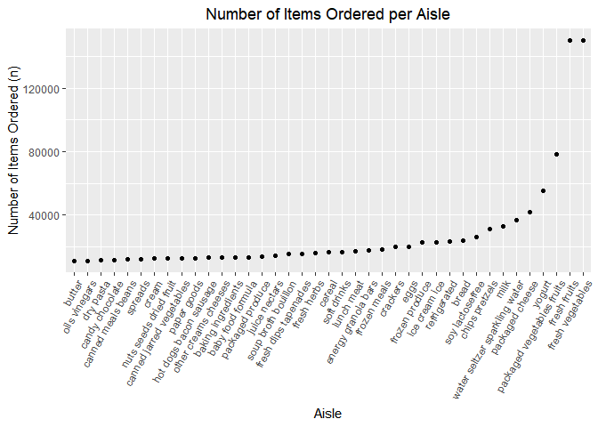

P8105 Data Science I Homework 3
================
Olivia Wang (hw2852)
2022-10-15

In preparation for the problems below, we will load the following
libraries:

``` r
library(tidyverse)
```

    ## ── Attaching packages ─────────────────────────────────────── tidyverse 1.3.2 ──
    ## ✔ ggplot2 3.3.6      ✔ purrr   0.3.4 
    ## ✔ tibble  3.1.8      ✔ dplyr   1.0.10
    ## ✔ tidyr   1.2.0      ✔ stringr 1.4.1 
    ## ✔ readr   2.1.2      ✔ forcats 0.5.2 
    ## ── Conflicts ────────────────────────────────────────── tidyverse_conflicts() ──
    ## ✖ dplyr::filter() masks stats::filter()
    ## ✖ dplyr::lag()    masks stats::lag()

``` r
library(readxl)
library(dplyr)
```

# Problem 1

This problem uses the `Instacart` data. This data set will be loaded
through the `p8105.datasets` library.

``` r
library(p8105.datasets)
data("instacart")
```

## 1.1 Description of `Instacart` Data

## 1.2 Analysis of `Instacart` Data

### Aisles

We can enumerate the number of aisles by applying the `group_by`
function to identify the number of unique `aisle_id` variable values.
The number of rows generated in the output would be the number of aisles
in the data set. Building upon the results generated from the `group_by`
function, we may determine the aisles from which the most items were
ordered. This process involves generating a summary of the number of
times each `aisle_id` appears in these data, then arranging the aisles
in decreasing order of the number of times it appears.

``` r
instacart %>%
  group_by(aisle_id) %>% 
  summarize(items_ordered = n()) %>% 
  arrange(desc(items_ordered))
```

    ## # A tibble: 134 × 2
    ##    aisle_id items_ordered
    ##       <int>         <int>
    ##  1       83        150609
    ##  2       24        150473
    ##  3      123         78493
    ##  4      120         55240
    ##  5       21         41699
    ##  6      115         36617
    ##  7       84         32644
    ##  8      107         31269
    ##  9       91         26240
    ## 10      112         23635
    ## # … with 124 more rows

There are **134 aisles** in the `Instacart` data set. Of the 134 aisles,
the following are the aisles from which the most items are ordered:

| Aisle Number | Number of Items Sold |
|:-------------|----------------------|
| **83**       | 150,609              |
| **24**       | 150,473              |
| **123**      | 78,493               |
| **120**      | 55,240               |
| **21**       | 41,699               |

### Plotting Aisle vs. Items Ordered

``` r
instacart %>% 
  group_by(aisle_id) %>% 
  mutate(items_ordered = n()) %>% 
  filter(items_ordered > 10000) %>% 
  ggplot(aes(x = aisle_id)) + 
  geom_histogram(color = "black", fill = "lightblue") + 
  labs(title = "Plot of Aisle by Numbers of Items Sold", x = "Aisle ID", y = "Number of Items Ordered")
```

    ## `stat_bin()` using `bins = 30`. Pick better value with `binwidth`.

<!-- -->

# Problem 2

## 2.1 Accelerometer Data: Read, Tidy, Wrangle

``` r
accelerometer_data = 
  read_csv("./accel_data.csv") %>% 
  janitor::clean_names(.) %>% 
  mutate(weekend_vs_weekday = if_else(day != "Saturday","weekday", "weekend"))
```

    ## Rows: 35 Columns: 1443
    ## ── Column specification ────────────────────────────────────────────────────────
    ## Delimiter: ","
    ## chr    (1): day
    ## dbl (1442): week, day_id, activity.1, activity.2, activity.3, activity.4, ac...
    ## 
    ## ℹ Use `spec()` to retrieve the full column specification for this data.
    ## ℹ Specify the column types or set `show_col_types = FALSE` to quiet this message.
