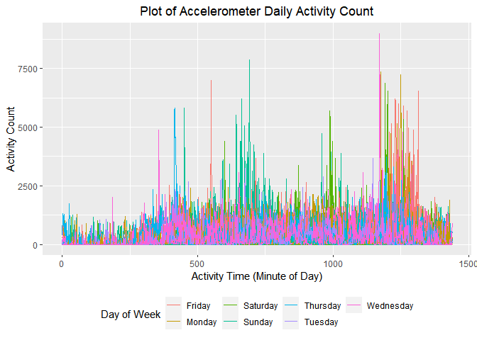

P8105 Data Science I Homework 3
================
Olivia Wang (hw2852)
2022-10-15

In preparation for the problems below, we will load the following
libraries:

``` r
library(tidyverse)
```

    ## ── Attaching packages ─────────────────────────────────────── tidyverse 1.3.2 ──
    ## ✔ ggplot2 3.3.6      ✔ purrr   0.3.4 
    ## ✔ tibble  3.1.8      ✔ dplyr   1.0.10
    ## ✔ tidyr   1.2.0      ✔ stringr 1.4.1 
    ## ✔ readr   2.1.2      ✔ forcats 0.5.2 
    ## ── Conflicts ────────────────────────────────────────── tidyverse_conflicts() ──
    ## ✖ dplyr::filter() masks stats::filter()
    ## ✖ dplyr::lag()    masks stats::lag()

``` r
library(readxl)
library(dplyr)
```

# Problem 1

This problem uses the `Instacart` data. This data set will be loaded
through the `p8105.datasets` library.

``` r
library(p8105.datasets)
data("instacart")
```

## 1.1 Description of `Instacart` Data

## 1.2 Analysis of `Instacart` Data

### Aisles

We can enumerate the number of aisles by applying the `group_by`
function to identify the number of unique `aisle_id` variable values.
The number of rows generated in the output would be the number of aisles
in the data set. Building upon the results generated from the `group_by`
function, we may determine the aisles from which the most items were
ordered. This process involves generating a summary of the number of
times each `aisle_id` appears in these data, then arranging the aisles
in decreasing order of the number of times it appears.

``` r
instacart %>%
  group_by(aisle_id) %>% 
  summarise(items_ordered = n()) %>% 
  arrange(desc(items_ordered))
```

    ## # A tibble: 134 × 2
    ##    aisle_id items_ordered
    ##       <int>         <int>
    ##  1       83        150609
    ##  2       24        150473
    ##  3      123         78493
    ##  4      120         55240
    ##  5       21         41699
    ##  6      115         36617
    ##  7       84         32644
    ##  8      107         31269
    ##  9       91         26240
    ## 10      112         23635
    ## # … with 124 more rows

There are **134 aisles** in the `Instacart` data set. Of the 134 aisles,
the following are the aisles from which the most items are ordered:

| Aisle Number | Number of Items Sold |
|:-------------|----------------------|
| **83**       | 150,609              |
| **24**       | 150,473              |
| **123**      | 78,493               |
| **120**      | 55,240               |
| **21**       | 41,699               |

### Plotting Aisle vs. Items Ordered

``` r
instacart %>% 
  group_by(aisle_id) %>% 
  mutate(items_ordered = n()) %>% 
  filter(items_ordered > 10000) %>% 
  ggplot(aes(x = aisle_id)) + 
  geom_histogram(color = "black", fill = "lightblue") + 
  labs(title = "Plot of Aisle by Numbers of Items Sold", x = "Aisle ID", y = "Number of Items Ordered")
```

    ## `stat_bin()` using `bins = 30`. Pick better value with `binwidth`.

<!-- -->

# Problem 2

## 2.1 Accelerometer Data: Read, Tidy, Wrangle

We will begin by importing and cleaning the CSV file containing this
patient’s accelerometer data. This process involves data import,
cleaning variable names, and applying the `pivot_longer` function to
convert the data from wide to long format. A new `weekend_vs_weekday`
variable was generated to indicate whether the entry corresponds to a
weekend or a weekday.

``` r
accelerometer_data = 
  read_csv("./accel_data.csv") %>% 
  janitor::clean_names(.) %>% 
  mutate(weekend_vs_weekday = if_else(day != "Saturday" & day != "Sunday","weekday", "weekend")) %>% 
  pivot_longer(
    activity_1:activity_1440, 
    names_to = "activity_time", 
    names_prefix = "activity_",
    names_transform = list(activity_time = as.integer),
    values_to = "activity_count")
```

    ## Rows: 35 Columns: 1443
    ## ── Column specification ────────────────────────────────────────────────────────
    ## Delimiter: ","
    ## chr    (1): day
    ## dbl (1442): week, day_id, activity.1, activity.2, activity.3, activity.4, ac...
    ## 
    ## ℹ Use `spec()` to retrieve the full column specification for this data.
    ## ℹ Specify the column types or set `show_col_types = FALSE` to quiet this message.

\*\*\* Data description

## 2.2 Total Daily Activity

Using the tidied accelerometer data generated in Part 2.1, we can
aggregate across daily minutes to create a total activity variable for
each of the 35 days of observation. We will first group the entries by
`day_id`, then apply the `summarise` function to generate a new variable
taking on the value of the sum of the activity counts associated with
the specific `day_id`.

``` r
accelerometer_data %>% 
  group_by(day_id) %>% 
  summarise(total_daily_activity = sum(activity_count)) %>% 
  print(n = 35)
```

    ## # A tibble: 35 × 2
    ##    day_id total_daily_activity
    ##     <dbl>                <dbl>
    ##  1      1              480543.
    ##  2      2               78828.
    ##  3      3              376254 
    ##  4      4              631105 
    ##  5      5              355924.
    ##  6      6              307094.
    ##  7      7              340115.
    ##  8      8              568839 
    ##  9      9              295431 
    ## 10     10              607175 
    ## 11     11              422018 
    ## 12     12              474048 
    ## 13     13              423245 
    ## 14     14              440962 
    ## 15     15              467420 
    ## 16     16              685910 
    ## 17     17              382928 
    ## 18     18              467052 
    ## 19     19              371230 
    ## 20     20              381507 
    ## 21     21              468869 
    ## 22     22              154049 
    ## 23     23              409450 
    ## 24     24                1440 
    ## 25     25              260617 
    ## 26     26              340291 
    ## 27     27              319568 
    ## 28     28              434460 
    ## 29     29              620860 
    ## 30     30              389080 
    ## 31     31                1440 
    ## 32     32              138421 
    ## 33     33              549658 
    ## 34     34              367824 
    ## 35     35              445366

\*\*\* Data description

## 2.3 Plotting Daily Inspection Activity

``` r
accelerometer_data %>% 
  group_by(day_id, day, activity_time) %>% 
  summarize(activity_count) %>% 
  ggplot(aes(x = activity_time, y = activity_count, color = day)) +
  geom_point() +
  theme(legend.position = "bottom")
```

    ## `summarise()` has grouped output by 'day_id', 'day'. You can override using the
    ## `.groups` argument.

<!-- -->
